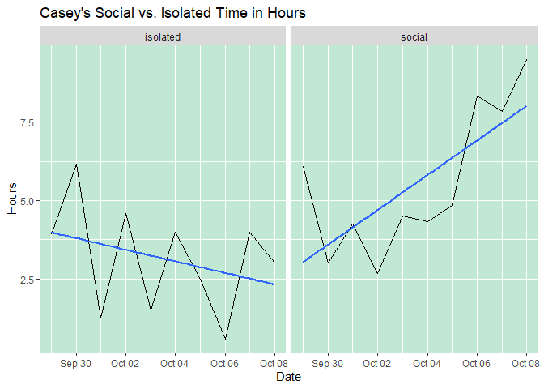
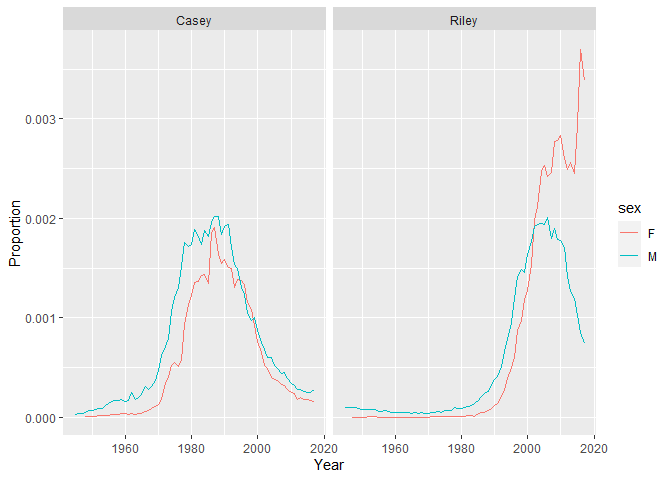
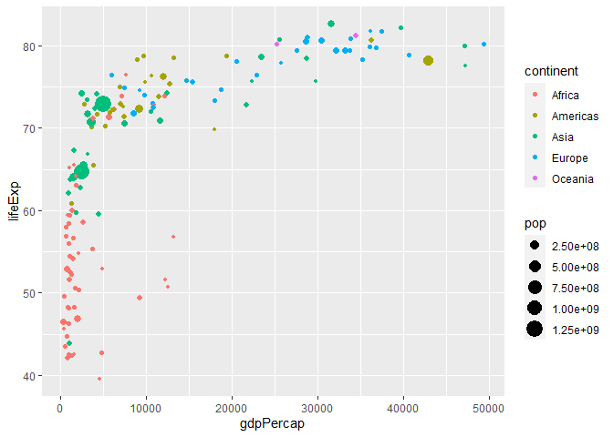

Joyce Huang: Learning Github
================

    ## -- Attaching packages --------------------------------------- tidyverse 1.3.1 --

    ## v ggplot2 3.3.5     v purrr   0.3.4
    ## v tibble  3.1.4     v dplyr   1.0.7
    ## v tidyr   1.1.3     v stringr 1.4.0
    ## v readr   2.0.2     v forcats 0.5.1

    ## -- Conflicts ------------------------------------------ tidyverse_conflicts() --
    ## x dplyr::filter() masks stats::filter()
    ## x dplyr::lag()    masks stats::lag()

    ## Linking to GEOS 3.9.1, GDAL 3.2.1, PROJ 7.2.1

    ## 
    ## Attaching package: 'lubridate'

    ## The following objects are masked from 'package:base':
    ## 
    ##     date, intersect, setdiff, union

``` r
knitr::opts_chunk$set(fig.path='Figs/')
```

## Intro

Hello folks! My name is Joyce Huang and I use **they/she** pronouns. I
am a first year student at Smith College, but I am originally from
Connecticut.

Here are some of the plots I have made for SDS192 (Intro to Data
Science) this far into the semester.

    ## `summarise()` has grouped output by 'date'. You can override using the `.groups` argument.

``` r
ggplot(data = calendar_data, mapping = aes(x = date, y = hours)) +
  geom_line() +
  geom_smooth(method = "lm", se = FALSE) +
  facet_wrap(~summary) +
  labs(x = "Date", y = "Hours", title = "Casey's Social vs. Isolated Time in Hours") +
  theme(panel.background = element_rect(fill = "#c1e8d2",
                                size = 2, linetype = "solid"))
```

    ## `geom_smooth()` using formula 'y ~ x'

<!-- -->

``` r
ggplot(data = babynames_riley_casey, mapping = aes(x = year, y = prop, group = sex, color = sex)) +
  geom_line() +
  facet_wrap(~name) +
  labs(x = "Year", y = "Proportion")
```

<!-- -->

``` r
gapminder_2007 <- gapminder %>% 
  filter(year == 2007)
```

``` r
ggplot(data = gapminder_2007, mapping = aes(x = gdpPercap, y = lifeExp, size = pop, color = continent)) +
  geom_point()
```

<!-- -->
